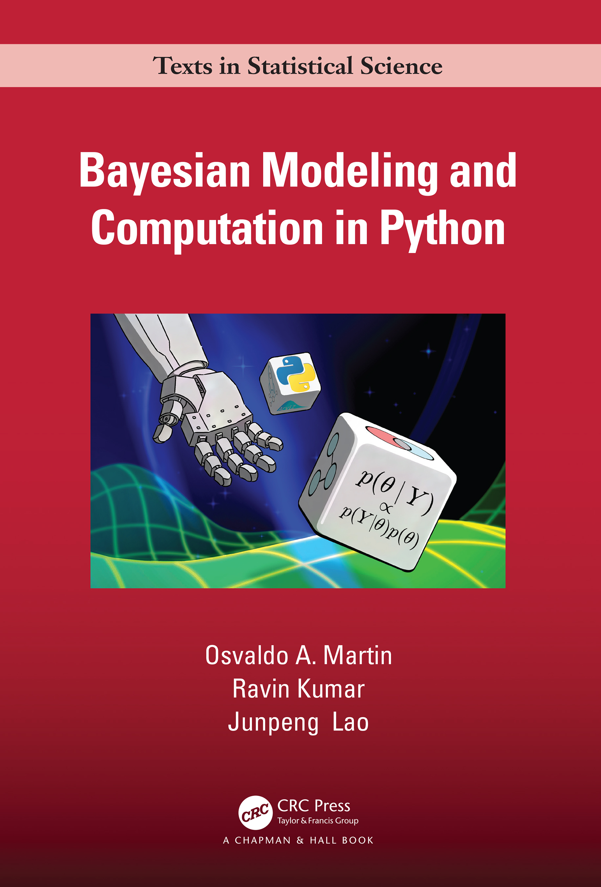

# Bayesian Modeling and Computation in Python Book Code Repository



This repository contains the all the code used to produce the book. 
This includes the visible code, and all code used to generate figures, tables, etc.  
NOTE: This repository is still a work in progress 

## Reporting Issues
If you see any issues please create an issue on [the issue tracker](https://github.com/BayesianModelingandComputationInPython/BookCode_Edition1/issues)

## Code Website

## Environment installation
To run the code you will need to install the correct packages in a computational environment.
We have provided instructions below for common options.

### Conda
```
conda env create -f environment.yml
conda activate bmcp
```

### Colab
The book code can also be run using Google Colab.
https://colab.research.google.com

More instructions to come soon
